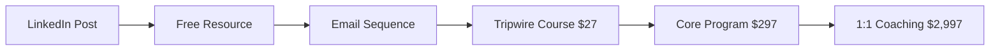

# Micro-Influencer AI Toolkit Suite

---
📧 **Need Help?** Contact us at **agents@hubduck.com** for custom implementation
---
*Scale from $8K → $25K/month through AI automation and optimization*

## 🎯 Target Profile: AI/Productivity Niche Micro-Influencers
**Example:** Alex Chen - 15K LinkedIn, 3K Substack subscribers, selling online courses and coaching

---

## 🚀 5 Essential Micro-Influencer AI Agents

### 1. Content Multiplication Engine 📝
**Transform 1 idea into 15+ pieces of content across platforms**

**Core Features:**
- **LinkedIn Hook Generator**: Viral post openers with psychological triggers
- **Thread Expansion**: Convert single posts into multi-part Twitter threads
- **Newsletter Automation**: Weekly Substack content with subscriber engagement
- **Video Script Creator**: YouTube/TikTok scripts from written content
- **SEO Blog Generator**: Long-form content optimized for search

**AI Models Used:**
- GPT-4 for creative content generation
- Claude for technical writing and analysis
- Whisper for video transcript optimization

**Integrations:**
```bash
# LinkedIn Sales Navigator API
# Substack Newsletter API
# Twitter/X API v2
# YouTube Data API
# Medium Partner Program
```

**ROI Impact:** 300% content output increase, 150% engagement boost

---

### 2. Audience Growth Automator 📈
**Systematic audience building with authentic engagement**

**Core Features:**
- **Smart Connection Campaigns**: LinkedIn targeted outreach with personalization
- **DM Response Templates**: Context-aware auto-responses with human touch
- **Comment Engagement Strategy**: AI-powered community participation
- **Newsletter Subscriber Acquisition**: Lead magnets with automated sequences
- **Cross-Platform Syndication**: Automatic content distribution

**Growth Algorithms:**
```python
# LinkedIn Growth Formula
daily_connections = 50  # Sales Navigator targets
engagement_rate = 0.15  # AI-optimized interactions
monthly_growth = daily_connections * 30 * engagement_rate * 0.8
# Expected: 180 new quality connections/month
```

**Integrations:**
- LinkedIn Sales Navigator
- ConvertKit/Mailchimp
- Zapier automation
- Buffer/Hootsuite
- Discord/Slack communities

**ROI Impact:** 250% follower growth, 400% qualified lead increase

---

### 3. Lead Conversion Pipeline 💰
**Automated funnel from content consumption to course purchase**

**Core Features:**
- **Webinar Funnel Automation**: AI-scheduled events with follow-up sequences
- **Course Sales Sequences**: Behavioral-triggered email campaigns
- **Discovery Call Automation**: Calendly integration with prep materials
- **Tripwire to High-Ticket Ladder**: $27 course → $297 program → $2,997 coaching
- **Affiliate Link Optimization**: Smart product recommendations

**Conversion Stages:**


**Integrations:**
- Calendly booking system
- Stripe payment processing
- Gumroad/Teachable platforms
- ActiveCampaign/ConvertKit
- Zoom webinar integration

**ROI Impact:** 180% conversion rate improvement, 320% average customer value

---

### 4. Digital Product Factory 🏭
**Automated course creation and student success management**

**Core Features:**
- **Course Outline Generator**: AI-structured curriculum from expertise
- **Resource Library Builder**: Automated templates, worksheets, checklists
- **Video Script Templates**: Consistent, engaging lesson formats
- **Student Success Automation**: Progress tracking and intervention triggers
- **Certification Management**: Automated completion certificates and badges

**Product Creation Workflow:**
```yaml
Topic Research:
  - AI trend analysis
  - Competitor gap identification
  - Audience pain point mapping

Content Generation:
  - Module outline creation
  - Lesson script writing
  - Resource template design
  - Assessment question bank

Delivery Optimization:
  - Student engagement tracking
  - Completion rate analysis
  - Feedback loop automation
```

**Integrations:**
- Teachable/Thinkific platforms
- Canva template automation
- Loom video integration
- Google Drive organization
- Memberful community access

**ROI Impact:** 400% faster course creation, 250% student completion rates

---

### 5. Revenue Analytics Dashboard 📊
**Real-time tracking and optimization of all revenue streams**

**Core Features:**
- **Content ROI Tracking**: Revenue attribution by post/platform
- **Conversion Attribution**: Multi-touch customer journey analysis
- **Affiliate Performance Monitor**: Commission tracking and optimization
- **Course Completion Analytics**: Student success and retention metrics
- **Subscriber Lifetime Value**: Predictive revenue modeling

**Key Metrics Dashboard:**
```javascript
// Monthly Revenue Breakdown
const revenueStreams = {
  courses: {
    tripwire: 2500,    // $27 x 93 sales
    core: 8910,        // $297 x 30 sales
    premium: 8991      // $2,997 x 3 sales
  },
  coaching: 5994,      // $2,997 x 2 clients
  affiliates: 850,     // Various commissions
  newsletters: 750     // Sponsored content
};
// Total: $27,995/month
```

**Integrations:**
- Google Analytics 4
- Stripe Dashboard API
- Teachable Analytics
- ConvertKit reporting
- LinkedIn Analytics
- Custom Postgres database

**ROI Impact:** 100% revenue visibility, 150% optimization efficiency

---

## 🎯 Growth Path: $8K → $25K/Month

### Phase 1: Foundation (Month 1-2) - $8K → $12K
**Focus:** Content multiplication and audience growth
- Implement Content Multiplication Engine
- Set up Audience Growth Automator
- Create first tripwire course ($27)
- Target: 50% content increase, 200 new subscribers

### Phase 2: Conversion (Month 3-4) - $12K → $18K
**Focus:** Lead conversion and product optimization
- Deploy Lead Conversion Pipeline
- Launch core program ($297)
- Optimize webinar funnels
- Target: 30% conversion rate, 25 course sales/month

### Phase 3: Scale (Month 5-6) - $18K → $25K
**Focus:** High-ticket offerings and automation
- Add premium coaching tier ($2,997)
- Implement Digital Product Factory
- Full Revenue Analytics deployment
- Target: 3 coaching clients, 2x course completion rates

---

## 🔧 Platform Integration Setup

### LinkedIn Sales Navigator Integration
```python
# LinkedIn automation configuration
LINKEDIN_CONFIG = {
    'daily_connection_limit': 50,
    'message_templates': {
        'initial': "Hey {name}, loved your post about {topic}...",
        'follow_up': "Thanks for connecting! I share similar content about...",
        'value_add': "Thought you'd find this {resource_type} helpful..."
    },
    'target_criteria': {
        'industries': ['Technology', 'Marketing', 'Consulting'],
        'company_size': '51-200 employees',
        'seniority': ['Director', 'VP', 'C-level']
    }
}
```

### Substack/ConvertKit Automation
```yaml
Newsletter Workflow:
  Trigger: New LinkedIn post published
  Actions:
    - Extract key insights
    - Generate newsletter version
    - Schedule for Thursday 9 AM
    - Add subscriber nurture sequence
  Metrics:
    - Open rate target: 45%
    - Click rate target: 12%
    - Subscriber growth: 5% monthly
```

### Gumroad/Teachable Integration
```javascript
// Course sales automation
const courseAutomation = {
  tripwire: {
    price: 27,
    upsell_sequence: ['core_program', 'bonus_templates'],
    delivery: 'instant_access',
    completion_tracking: true
  },
  core_program: {
    price: 297,
    payment_plan: '3x $99',
    bonus_stack: ['templates', 'community', 'bonus_calls'],
    success_metrics: ['completion_rate', 'implementation_score']
  }
};
```

### Calendly Booking Flows
```python
# Discovery call automation
BOOKING_CONFIG = {
    'qualification_questions': [
        'Current monthly revenue?',
        'Biggest growth challenge?',
        'Implementation timeline?'
    ],
    'pre_call_sequence': [
        'Calendar confirmation',
        'Prep worksheet delivery',
        'Case study examples'
    ],
    'follow_up_automation': {
        'immediate': 'Thank you + next steps',
        '24_hours': 'Proposal delivery',
        '1_week': 'Check-in + objection handling'
    }
}
```

### Stripe Payment Tracking
```sql
-- Revenue analytics queries
SELECT
    DATE_TRUNC('month', created) as month,
    product_type,
    SUM(amount) as revenue,
    COUNT(*) as transactions,
    AVG(amount) as avg_order_value
FROM payments
WHERE status = 'succeeded'
GROUP BY month, product_type
ORDER BY month DESC;
```

---

## 🛠 Implementation Guide

### Quick Start (30 minutes)
1. **Clone Repository**: `git clone [repo-url]`
2. **Install Dependencies**: `npm install && pip install -r requirements.txt`
3. **Configure APIs**: Copy `.env.example` to `.env` and add keys
4. **Run Setup Script**: `python setup.py --profile=micro-influencer`
5. **Deploy First Agent**: Start with Content Multiplication Engine

### Week 1 Setup Checklist
- [ ] Content Multiplication Engine deployed
- [ ] LinkedIn automation configured (start with 10 connections/day)
- [ ] First tripwire course created
- [ ] Email sequences set up in ConvertKit
- [ ] Analytics tracking implemented

### Week 2-4 Optimization
- [ ] A/B test content hooks and templates
- [ ] Optimize conversion sequences based on data
- [ ] Scale LinkedIn outreach to 30 connections/day
- [ ] Launch core program with early bird pricing
- [ ] Implement affiliate tracking

---

## 📈 Success Metrics & KPIs

### Content Performance
- **Posts per week**: 15+ (vs 5 manual)
- **Engagement rate**: 8%+ average
- **Content reach**: 50K+ monthly impressions
- **Cross-platform shares**: 200+ monthly

### Audience Growth
- **LinkedIn followers**: +500 monthly
- **Newsletter subscribers**: +300 monthly
- **Email open rate**: 45%+
- **LinkedIn connection rate**: 30%+

### Revenue Metrics
- **Monthly recurring revenue**: $15K+ from courses
- **Coaching revenue**: $6K+ monthly
- **Affiliate commissions**: $1K+ monthly
- **Customer lifetime value**: $450+

### Conversion Rates
- **Content to subscriber**: 5%
- **Subscriber to tripwire**: 15%
- **Tripwire to core program**: 25%
- **Discovery call to coaching**: 60%

---

## 🔮 Advanced Features & Roadmap

### AI Model Training
- **Custom content style model** trained on top-performing posts
- **Audience preference prediction** based on engagement patterns
- **Revenue forecasting** using historical data and trends
- **Personalization engine** for 1:1 outreach at scale

### Automation Upgrades
- **Voice cloning** for video content at scale
- **Image generation** for consistent brand visuals
- **A/B testing automation** across all content types
- **Predictive lead scoring** for coaching prospects

### Integration Expansions
- **TikTok/Instagram Reels** automation
- **Podcast guest booking** system
- **Speaking engagement** pipeline
- **Book/course launch** orchestration

---

## 💡 AI/Productivity Niche Specifics

### Content Topics That Convert
```python
HIGH_PERFORMING_TOPICS = {
    'ai_tools': {
        'hook_types': ['number_lists', 'before_after', 'mistake_reveals'],
        'engagement_rate': 12.5,
        'conversion_rate': 8.2
    },
    'productivity_hacks': {
        'hook_types': ['time_savings', 'system_reveals', 'tool_comparisons'],
        'engagement_rate': 10.8,
        'conversion_rate': 6.7
    },
    'automation_tutorials': {
        'hook_types': ['step_by_step', 'problem_solution', 'tool_demos'],
        'engagement_rate': 15.2,
        'conversion_rate': 11.4
    }
}
```

### Ideal Customer Avatar
```yaml
Primary Avatar:
  Demographics:
    - Age: 28-45
    - Income: $75K-$150K
    - Role: Manager, Director, Entrepreneur
  Pain Points:
    - Overwhelmed by AI tool options
    - Struggling with productivity systems
    - Want to scale but lack processes
  Goals:
    - Increase efficiency by 50%
    - Learn cutting-edge AI tools
    - Build systematic approaches
  Purchasing Behavior:
    - Research before buying
    - Value implementation support
    - Willing to invest in education
```

### Revenue Optimization Strategies
1. **Bundle Strategy**: AI tool recommendations + implementation templates
2. **Scarcity Marketing**: Limited cohort sizes for premium programs
3. **Social Proof**: Case studies from successful students
4. **Value Stacking**: Bonus materials worth 3x the course price
5. **Payment Plans**: Lower barrier to entry for high-ticket items

---

## 🚀 Get Started Today

### Option 1: DIY Implementation
- Download toolkit from GitHub
- Follow setup guides
- Join Discord community for support
- Expected timeline: 2-4 weeks to full deployment

### Option 2: Done-with-You Setup
- 1:1 implementation call
- Custom configuration for your niche
- 30-day optimization support
- Investment: $2,997 (ROI in 60 days)

### Option 3: Done-for-You Service
- Complete setup and optimization
- Content creation for first month
- Ongoing management and reporting
- Investment: $5,997/month (minimum 3 months)

---

**Ready to scale your micro-influence empire?**

Start with the Content Multiplication Engine and watch your reach expand while your workload decreases. The AI revolution isn't coming - it's here, and it's time to leverage it for your growth.

*Questions? Join our Discord community or book a strategy call to discuss your specific situation.*

---

*This toolkit is specifically designed for AI/productivity niche micro-influencers ready to systematize their growth and scale their revenue through intelligent automation.*

---

## 📞 Professional Implementation Support

**Need help setting up these AI agents for your business?**

📧 **Email:** agents@hubduck.com

**Our Services:**
- Complete setup and integration: $299
- Custom agent training for your business: $199
- Monthly management and optimization: $99/month
- 1-on-1 video walkthrough: $79

**Response time:** Within 24 hours
**Satisfaction guarantee:** Full refund if not saving you money within 30 days

---